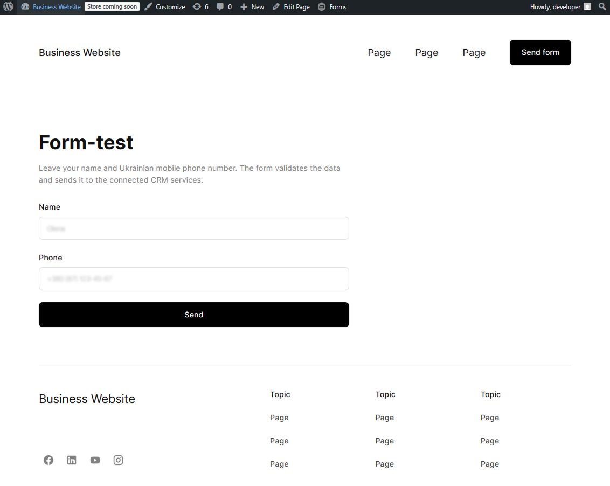
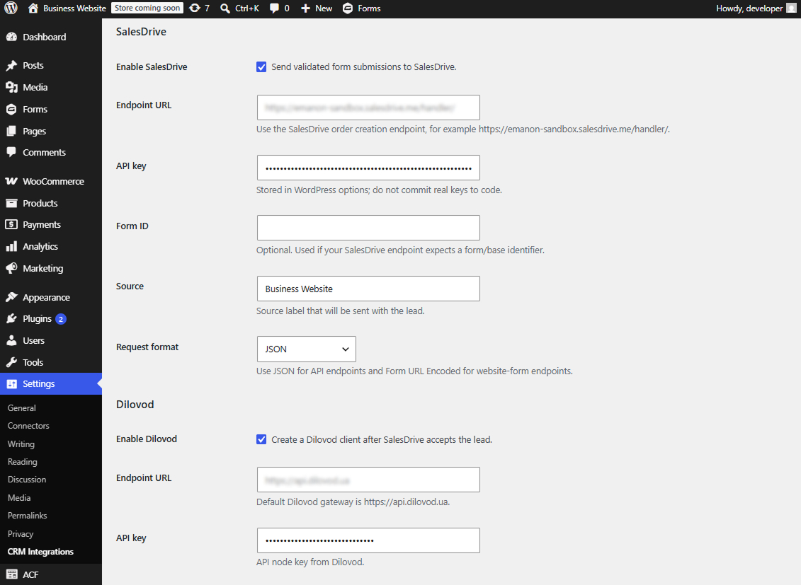
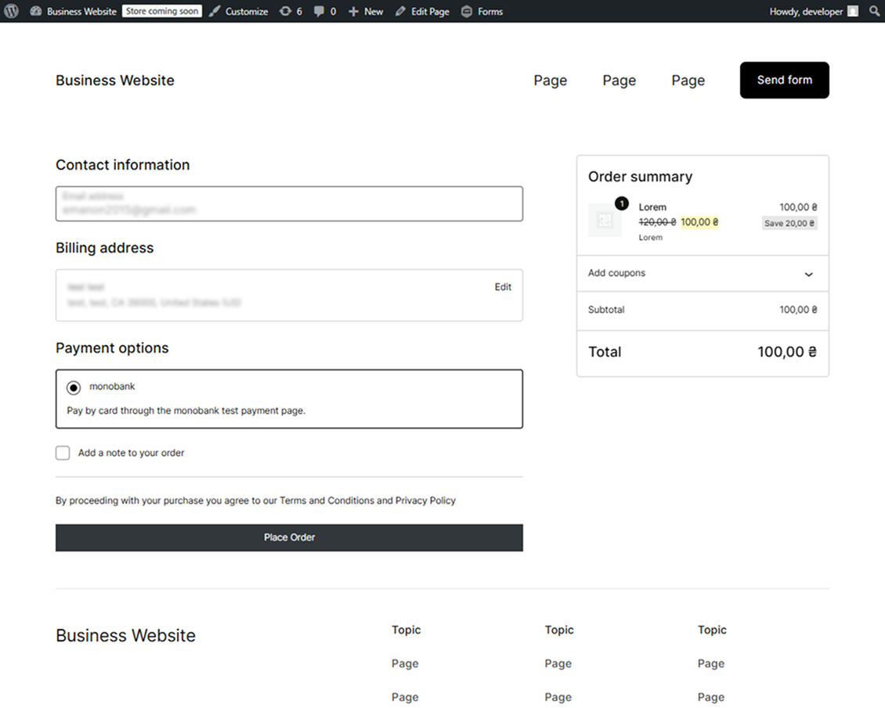
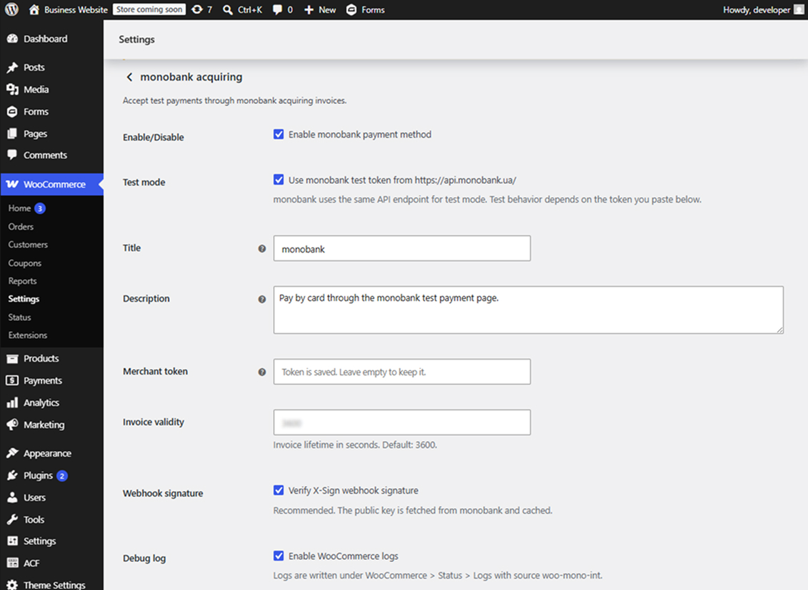

# WordPress Business Website

A custom responsive WordPress/WooCommerce website developed from a provided Figma design.

The project demonstrates custom WordPress theme development, flexible content management with ACF, third-party CRM integrations, form validation and spam protection, as well as development of a custom WooCommerce payment gateway.

## Demo

Live demo: https://emanon-sandbox.ct.ws/

> Administrative access is not publicly available. Screenshots below demonstrate the WordPress admin functionality, integration settings, and plugin configuration.

## Tech Stack

* WordPress
* WooCommerce
* PHP
* JavaScript
* SCSS / CSS
* Advanced Custom Fields Pro
* Gravity Forms
* REST API
* SalesDrive API
* Dilovod API
* monobank Acquiring API

## Custom WordPress Theme

URLs: [Home](https://emanon-sandbox.ct.ws/) + [Contact](https://emanon-sandbox.ct.ws/contact/)

A custom WordPress theme was developed based on a provided Figma layout.

### Features

* Responsive page layout
* Custom responsive header and footer
* Mobile navigation with open/close animation
* Interactive hover effects
* Flexible page building using ACF Flexible Content
* Reusable section templates
* Custom page templates
* Responsive implementation based on the original design

Flexible sections are stored in:

`theme/business-website/template-parts/flexible/`

The main flexible page template:

`theme/business-website/templates/template-flexible.php`

## Form Validation and CRM Integration

A custom form was implemented with client-side and server-side validation.

### Validation

* Name validation
* Ukrainian phone number validation and normalization
* Client-side phone mask

### Spam Protection

* WordPress nonce verification
* Hidden honeypot field
* Minimum form submission time validation
* IP-based rate limiting using WordPress transients

### CRM Integration

Submitted form data can be sent to external CRM services.

Implemented integrations include:

* SalesDrive
* Dilovod
* WordPress REST API webhook handling
* Telegram notifications when external API requests fail
* WP-Cron API availability checks

CRM integration logic:

`theme/business-website/inc/crm-integrations.php`

### CRM Integration Screenshots

The screenshots below demonstrate the frontend form and the WordPress admin settings used to configure CRM data transfer.

#### Contact Form

#### CRM Integration Settings

> Login credentials and WordPress admin access are intentionally not published to prevent unauthorized changes to the demo website.

## Custom WooCommerce Payment Gateway

The project also includes a custom WooCommerce payment gateway plugin for monobank acquiring.

Plugin source:

`plugin/woo-mono-int/`

### Features

* Custom WooCommerce payment method
* WooCommerce payment settings
* Merchant token validation
* UAH currency validation
* Invoice creation through the monobank API
* Redirect to the monobank payment page
* WooCommerce order metadata
* monobank webhook handling
* Webhook signature verification
* WooCommerce logging
* WordPress sanitization and escaping practices

WordPress and WooCommerce core files are not modified.

### Plugin Screenshots

The screenshots below demonstrate the installed payment gateway, its appearance during checkout, and the WooCommerce configuration page.

#### Payment Method in Checkout

#### Payment Gateway Settings

### Download Plugin

A packaged version of the custom WooCommerce payment gateway plugin is also available separately:

[Download WooCommerce monobank integration plugin](https://drive.google.com/file/d/1q9mc6CLsBEyehPXNMXwR8WAMY7FvdHwr/view?usp=sharing)

## Requirements

* WordPress 6.0+
* PHP 7.4+
* WooCommerce
* Advanced Custom Fields Pro
* Gravity Forms

External integrations require corresponding API credentials.

## Security

API keys, passwords and external service credentials are not stored in this repository.

WordPress administrator credentials and website backups are intentionally not publicly shared. Administrative functionality is demonstrated through screenshots instead.